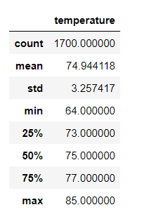
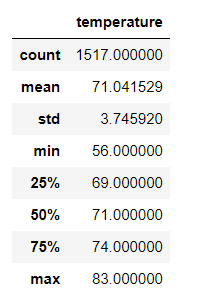

# Surfs_Up

## Overview of Analysis

The purpose of this analysis was to filter through [hawaii.sqlite](hawaii.sqlite) data to understand the temperature of the island Awahoo in hopes to raise money for a surf shop. The temperatures of Hawaii will be filtered by using Python and SQL-lite in Jupyter Notebook to better understand the temperatures in June and December. By providing data analytics on temperature,  we hope to gain the trust of investors to open the surf and shake shop in Awahoo.

---
## Results

The primary tools used in this analysis were SQLAlchemy. SQLAlchemy helps access the sql-lite file, reflect the existing database into a new model that is usable and then recreate the data into a database using Pandas.

The first objective was to pull the statistics for June. After the query was created to filter through the tobs and date rows, describe method was used to pull the statistics for June as seen below.

##### June Temperature Statistics

The same method to find June's statistics was then duplicated for December. The only input changed was the month that was filtered for. For December it would be 12 instead of 06 and then re-run the describe method for the statistics (see below).
##### December Temperature Statistics

##### June & December Statistics
- Here are the statistics for June and December temperatures.
- Total data count for June was 1700 and December 1517
- The max temperature for June was 85 and December 83. 
- The min temperature for June was 64 and December 56.
- The mean temperature for June was 74.9, whereas December 71. Both are near their respective 2nd quartiles.
- Standard deviation for June was 3.257 and December 3.746. This means there is a larger variance in temperature during December than in June.

---
## Summary
The data in the results section displays temperature statistics on the island of Awahoo for June and December. While this data may be suitable to gain investor confidence, we can also run additional queries to better understand the area's weather conditions. Using the same Hawaii.sqlite file we can run a query to filter the precipitation. I would also recommend running queries based on a particular city. This way you can find the city with the best weather year round on the island. Another query to suppor the temperature query would be to run a query for the entire year and then compare those results with what we found in this analysis.

---
## Resources
Python Files: [SurfsUp_Challenge.ipynb](SurfsUp_Challenge.ipynb)
SQL-lite File: [hawaii.sqlite](hawaii.sqlite)